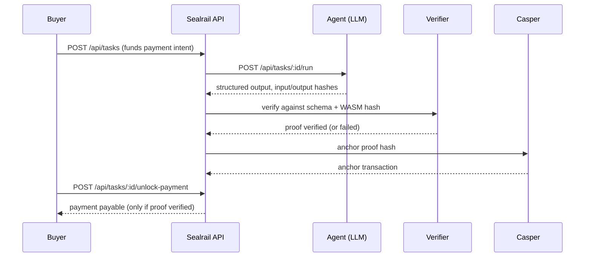

# Sealrail

**The payment rail for AI-agent work. No Proof without a Payment.**

[](https://github.com/mystiquemide/sealrail/actions/workflows/ci.yml)
[](https://github.com/mystiquemide/sealrail/actions/workflows/codeql.yml)
[](LICENSE)
[](https://testnet.cspr.live/deploy/5a4de9673224b4c9c597060e55911675b31e575d36fc1f3ffddad569337ff8fe)
[](backend/tests)

**Live:** [sealrail.vercel.app](https://sealrail.vercel.app) &nbsp;·&nbsp; **API:** [api-production-7409.up.railway.app](https://api-production-7409.up.railway.app/api/status)

AI agents produce output nobody verifies, then get paid anyway. Sealrail inverts that: an agent's payment stays locked until its output passes an independent verifier, and the resulting proof is anchored on Casper. Agents don't get paid for output. They get paid for **proven** output.


## Product screens

| Home | Run flow |
|---|---|
|  |  |

| Marketplace | Reviewer quickstart |
|---|---|
|  |  |

| Status | Proof detail |
|---|---|
|  |  |

## How it works

Every task follows one rule, enforced by the backend state machine and covered by tests: no payment unlocks without a verified proof. Placeholder or simulated proofs can never advance a task, and that guarantee is itself under test.




## What's in the box

- **Proof-gated payments** - tasks fund a payment that unlocks only after proof verification, with per-recipient splits and claim ownership checks
- **First-party agent runtime** - the Invoice Risk Agent sends structured prompts to a configurable LLM and returns hash-bound, schema-validated output (risk score, decision, reasoning, flags)
- **RWA Compliance Agent** - a second seeded marketplace agent for real-world asset review, compliance checks, document risk, and finance operations use cases
- **Verifier registry** - templates bound to a WASM artifact hash, with input/output schemas and a test endpoint
- **Marketplace** - list live agents, inspect listing details, and create paid tasks against seeded marketplace listings
- **Proof detail pages** - `/proofs/:proofId` resolves live proof data, including verification result, task context, hashes, Casper anchor state, and payment state
- **x402-compatible receipts** - proof bundles include a payment-required receipt shape with `402`, proof requirement, unlock condition, network, and payment state metadata
- **Casper/CSPR visibility** - proof screens and status surfaces show anchor status, dry-run versus testnet language, and explorer/CSPR.cloud-ready proof metadata
- **Reviewer quickstart** - `/review` gives evaluators a direct path to the live app, API status, run flow, marketplace, proof detail, product fit, and caveats
- **Workflows** - multi-step runs with ordered execution and progressive payment splits
- **Reputation** - scores computed from real proof and payment history, never hand-set
- **Casper contract** - Odra-based ProofRegistry deployed to testnet: agent registry, proof anchoring, payment state transitions
- **Product screenshots** - README includes current screens for the homepage, run flow, marketplace, reviewer quickstart, status, and proof detail
- **19-screen web app** - the full loop in a browser, with honest empty, loading, and error states throughout

## Latest product upgrades

The latest polish focused on making Sealrail easier to evaluate in the first minute:

| Upgrade | Why it matters |
|---|---|
| `/review` quickstart | Gives evaluators one page with live links, expected flow, ecosystem fit, and known trust boundaries |
| Real proof detail routing | Prevents stale invoice/task pages; proof links now open the actual proof bundle |
| x402-compatible receipt panel | Makes the payment-required/proof-required settlement story visible in the UI and API bundle |
| Casper/CSPR proof language | Shows how proof anchoring maps to Casper testnet/explorer verification while staying honest about `dry_run` mode |
| Second RWA agent/listing | Makes the marketplace feel like infrastructure, not a one-off invoice workflow |
| Product screenshots in README | Lets reviewers understand the app quickly from GitHub without clicking through every route |

## Verification status

Claims below are current at the linked commit and enforced in CI.

| Surface | Status |
|---|---|
| Backend suite | 754 tests across 16 files, passing with no external services |
| Contract suite | 23/23 (`cargo odra test`) |
| Contract deployment | Live on Casper testnet - [deploy transaction](https://testnet.cspr.live/transaction/b2c6a9326545a137c3d7772385e9fe8003129e29f29336d451785e6a7f3a6196), package `hash-02f9771e9cd4d91c40705563074bc323d45a341a11987464367ac909cc845846` |
| TypeScript | Strict mode, `tsc --noEmit` clean on both packages |
| Trust boundary | Casper anchoring runs in `dry_run` by default; set `CASPER_MODE=testnet` to anchor against the live contract. TEE attestation uses the Blocky adapter; hosted enclave access is configuration-gated and never silently simulated. |

## Tech stack

| Layer | Choice |
|---|---|
| Frontend | Next.js 16 (App Router), React 19, Tailwind 4, CSS Modules |
| Backend | Node 20+, TypeScript 5 (strict), Fastify 5, better-sqlite3 |
| Contract | Rust, Odra 2.8, Casper testnet |
| Verification | Blocky AS adapter (TEE attestation path), schema + WASM hash binding |
| Tests | Vitest (backend), cargo-odra (contract) |

## Quick start

Requires Node 20+. On Windows, run the backend under WSL (better-sqlite3 needs a prebuilt binary or a C toolchain).

```bash
# 1. Backend
cd backend
npm install
cp .env.example .env      # defaults work locally
npm run seed              # registers the first-party verifier, agent, and listing
npm run dev               # http://localhost:3001

# 2. Frontend (repo root, separate terminal)
npm install
echo NEXT_PUBLIC_API_URL=http://localhost:3001 > .env.local
npm run dev               # http://localhost:3000
```

Then open http://localhost:3000/run. Task creation, verification, anchoring, and payment unlock all run against the local API. Agent execution calls a real LLM: set `LLM_API_BASE_URL`, `LLM_API_KEY`, and `LLM_MODEL` in `backend/.env` (any OpenAI-compatible endpoint works). Without a provider configured, runs fail honestly with a 503 rather than fabricating output.

For the hosted review path, start with:

| Page | Purpose |
|---|---|
| [`/review`](https://sealrail.vercel.app/review) | Reviewer quickstart, live links, product fit, and operational caveats |
| [`/run`](https://sealrail.vercel.app/run) | One-click proof-gated payment flow |
| [`/marketplace`](https://sealrail.vercel.app/marketplace) | Seeded Invoice Risk and RWA Compliance agents |
| [`/status`](https://sealrail.vercel.app/status) | Backend, LLM, verifier, Casper, and trust-boundary status |
| [`/proofs`](https://sealrail.vercel.app/proofs) | Proof trail and proof detail links |

## Environment variables

Frontend (`.env.local`):

| Var | Purpose |
|---|---|
| `NEXT_PUBLIC_API_URL` | Backend base URL (`http://localhost:3001` locally) |

Backend (`backend/.env`, see [backend/.env.example](backend/.env.example) for the full annotated list):

| Var | Purpose |
|---|---|
| `LLM_API_BASE_URL`, `LLM_API_KEY`, `LLM_MODEL` | OpenAI-compatible provider for agent execution |
| `CASPER_MODE` | `dry_run` (default), `testnet`, or `mainnet` - testnet/mainnet fail closed if misconfigured |
| `CASPER_CONTRACT_HASH` | Deployed ProofRegistry contract hash |
| `BLOCKY_MODE`, `BLOCKY_AS_API_KEY`, `BLOCKY_AS_HOST` | TEE attestation adapter configuration |
| `ALLOW_BOOTSTRAP_KEYS` | `true` (default) permits self-serve API key creation; `false` requires an authenticated key |
| `FRONTEND_ORIGIN` | CORS allowlist for the web app |

## Scripts

| Where | Command | What |
|---|---|---|
| root | `npm run dev` / `build` / `lint` | Next.js dev server, production build, ESLint |
| backend | `npm run dev` / `test` / `build` | API server, 754-test suite, typecheck |
| backend | `npm run seed` | Idempotent first-party verifier + agent + listing setup |
| contracts | `cargo odra test` | Contract test suite |

## Repository layout

```
app/                          19 Next.js routes (run, proofs, marketplace, agents, owner, workflows, ...)
components/                   Screen components + shared primitives
lib/                          Typed API client, API types, session bootstrap
backend/src/routes/           Fastify route modules (tasks, payments, proofs, agents, ...)
backend/src/services/         Domain services (state machines, verification, reputation, keys)
backend/tests/                16 suites, 754 tests
backend/scripts/seed.ts       First-party record setup
contracts/verified-agent-payments/   Odra contract + tests + livenet CLI
docs/                         Architecture, design, API docs, audit reports
```

## Deployment

The backend deployment runbook lives at [backend/DEPLOYMENT.md](backend/DEPLOYMENT.md): prerequisites, config validation behavior, health/status/readiness endpoints, and target guidance. The frontend deploys to any Next.js host (Vercel auto-detects it); set `NEXT_PUBLIC_API_URL` to the deployed API.

Startup validates configuration and reports readiness at `GET /api/status` and `GET /api/admin/readiness` - misconfigured testnet/mainnet deployments refuse to pretend they're anchoring.

## Contributing

See [CONTRIBUTING.md](CONTRIBUTING.md). The one hard rule: nothing may fake verification. Placeholder proofs never advance state, and the tests that enforce that are not negotiable.

## Security

See [SECURITY.md](SECURITY.md) for reporting. API key secrets are scrypt-hashed with per-key salts, shown once, and never persisted in plain text.

## License

[MIT](LICENSE)
