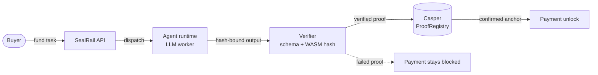
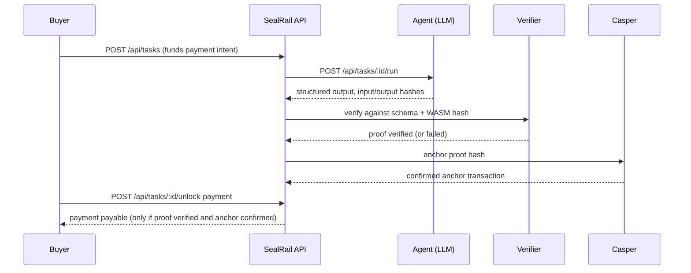

# SealRail

**Proof-gated payment rail for invoice and RWA agents on Casper. No Proof without a Payment.**

[](https://github.com/mystiquemide/sealrail/actions/workflows/ci.yml)
[](https://github.com/mystiquemide/sealrail/actions/workflows/codeql.yml)
[](LICENSE)
[](https://testnet.cspr.live/deploy/9a708f9e84c6d8f2d93d196823312a7f6ce8f903b93c344115f7e8c9c72edd6d)
[](backend/tests)
[](https://api.sealrail.xyz/api/status)

**Live app:** [sealrail.xyz](https://sealrail.xyz) &nbsp;·&nbsp; **Judge path:** [sealrail.xyz/review](https://sealrail.xyz/review) &nbsp;·&nbsp; **API status:** [api.sealrail.xyz/api/status](https://api.sealrail.xyz/api/status)

## Casper Agentic Buildathon Final Round

SealRail qualified for the Casper Agentic Buildathon 2026 Final Round. The final-round story is one loop:

> Invoice/RWA work enters the rail. An AI agent produces structured output. A verifier proves the output. Casper anchors the proof. Payment becomes unlockable only after proof exists.

AI agents should not get paid just because they produced text. SealRail keeps the payment state locked until the work is independently verified and the proof trail is anchored on Casper. The live demo also shows the negative case: a failed proof creates no anchor and keeps payment blocked.

### Judge quick path

1. Open [`/review`](https://sealrail.xyz/review) for the scoring map and trust boundaries.
2. Click **Run full flow** on [`/run`](https://sealrail.xyz/run) to create an invoice-risk task, run the AI invoice-risk agent, verify the output, anchor on Casper testnet, and unlock payment state.
3. Click **Run failing proof** to see bad output halt the rail: no Casper anchor and payment stays blocked.
4. Open the generated proof detail or browse [`/proofs`](https://sealrail.xyz/proofs) to inspect persisted proof bundles and x402-compatible receipts.
5. Check [`/status`](https://sealrail.xyz/status) for live system status and pending trust-boundary items.

### Live proof links

| Surface | Link |
|---|---|
| Reviewer entrypoint | [`https://sealrail.xyz/review`](https://sealrail.xyz/review) |
| Demo runner | [`https://sealrail.xyz/run`](https://sealrail.xyz/run) |
| Proof explorer | [`https://sealrail.xyz/proofs`](https://sealrail.xyz/proofs) |
| Latest production proof | [`0b9bad2e-3fe8-4ab5-80fb-4fa12de95f77`](https://sealrail.xyz/proofs/0b9bad2e-3fe8-4ab5-80fb-4fa12de95f77) |
| Casper anchor from latest production proof | [`9a708f9e…c72edd6d`](https://testnet.cspr.live/deploy/9a708f9e84c6d8f2d93d196823312a7f6ce8f903b93c344115f7e8c9c72edd6d) |
| System status | [`https://sealrail.xyz/status`](https://sealrail.xyz/status) |

### Criteria map

| Casper final-round criterion | SealRail proof |
|---|---|
| Working prototype | Production web app, API, proof explorer, proof detail pages, and status board are live. |
| Casper smart-contract usage | Proof hashes are anchored through the Casper testnet ProofRegistry path; successful deploys resolve on cspr.live. |
| AI / agentic systems | The live Invoice Risk Agent returns structured output, but cannot unlock payment by itself. |
| Real-world applicability | Invoice risk checks gate a payable state before release; RWA compliance is shown as the next marketplace vertical using the same rail. |
| UX / design | `/review` gives judges one path, `/run` shows the happy path and failing-proof invariant, `/status` discloses live vs pending components. |
| Long-term ecosystem impact | Proof-gated payment can become a Casper-native primitive for autonomous agents and RWA operations. |

### Trust boundaries: live vs pending

| Component | Current state | What is real |
|---|---|---|
| Casper ProofRegistry | Live on testnet | Proof hashes are anchored through the Casper testnet path before payment unlock. |
| AI invoice-risk agent | Live | LLM-backed agent returns structured invoice-risk output with hash-bound proof data. |
| RWA compliance listing | Preview | Seeded marketplace listing and verifier template are visible, but the dedicated RWA runtime is clearly labelled preview until connected. |
| Verifier + state machine | Live | Payment unlock fails closed unless a verified proof exists and the Casper anchor is confirmed. |
| Failing-proof demo | Live | Bad output produces a failed proof state, no anchor, and blocked payment. |
| x402-compatible receipt | Live format | Proof bundles include payment-required receipt metadata, proof requirement, unlock condition, network, and payment state. |
| CSPR.cloud | Partially live | Deploy confirmation and node checks are wired; external facilitator/rate signals can be unavailable and are not required for the proof-gated payment loop. |
| Hosted TEE / Blocky AS | Pending hosted access | The adapter and configuration gate are present, but the live demo does not claim hosted enclave attestation until access is configured. |
| CSPR settlement | Roadmap | Current build proves proof-gated payment state plus Casper anchoring; wallet-bound CSPR settlement is next. |


## Product screens

| Home | Run flow |
|---|---|
|  |  |

| Marketplace | Reviewer quickstart |
|---|---|
|  |  |

| Status | Proof detail |
|---|---|
|  |  |

## How it works

Every task follows one rule, enforced by the backend state machine and covered by tests: no payment unlocks without a verified proof. Placeholder or simulated proofs can never advance a task.





## What is in the box

- **Proof-gated payments** — tasks fund a payable state that unlocks only after proof verification and confirmed Casper anchoring, with per-recipient splits and claim ownership checks.
- **First-party Invoice Risk Agent** — sends structured prompts to a configurable LLM and returns hash-bound, schema-validated output: risk score, decision, reasoning, and flags.
- **RWA Compliance Agent** — a second seeded marketplace listing for real-world asset review, compliance checks, document risk, and finance operations; it is labelled preview until its dedicated runtime is connected.
- **Verifier registry** — templates bound to a WASM artifact hash, with input/output schemas and a test endpoint.
- **Marketplace** — list agents, distinguish runnable invoice-risk listings from preview RWA listings, inspect listing details, and create paid tasks for the live invoice-risk runtime.
- **Proof explorer and proof details** — `/proofs` and `/proofs/:proofId` resolve live proof data, verification result, task context, hashes, Casper anchor state, and payment state.
- **Failing-proof demo** — `/run` includes a visible path where rejected output keeps payment blocked and creates no Casper anchor.
- **x402-compatible receipts** — proof bundles include a payment-required receipt shape with `402`, proof requirement, unlock condition, network, and payment state metadata.
- **Casper/CSPR proof metadata** — proof screens and status surfaces show anchor status, CSPR.cloud-backed deploy confirmation, explorer links, and testnet contract metadata.
- **Casper Wallet sign-in** — users connect Casper Wallet, sign a nonce-carrying challenge, and receive a wallet-scoped API key for owner-sensitive actions.
- **MCP server** — real `@modelcontextprotocol/sdk` stdio server with 5 tools: status, manifest, proof listing, proof detail, and payment-backed task creation.
- **CSPR.cloud integration** — deploy confirmation, CSPR/USD rate lookup, x402 facilitator status, and Casper node health are exposed through dedicated API endpoints; external availability is shown honestly.
- **Reviewer quickstart** — `/review` gives evaluators a direct judge path, live proof links, criteria map, and trust boundaries.
- **Workflows and reputation** — multi-step runs with ordered execution, progressive payment splits, and reputation computed from proof/payment history.
- **Casper contract** — Odra-based ProofRegistry deployed to testnet: agent registry, proof anchoring, and payment state transitions.

## Latest product upgrades

| Upgrade | Why it matters |
|---|---|
| **Confirmed Casper anchors before payment unlock** | SealRail now treats a Casper anchor as successful only after deploy execution is confirmed, preventing reverted deploys from unlocking payment. |
| **Failing-proof demo** | Judges can click one button to see the invariant: bad output creates no anchor and payment remains blocked. |
| **Reviewer judge page** | `/review` now gives one clean scoring surface with live proof links, CTAs, criteria map, and trust boundaries. |
| **Railway deployment** | Backend runs on Railway with automatic deploys from GitHub, persistent volume storage, and health monitoring. |
| **CSPR.cloud integration** | Deploy confirmation, rate lookup, x402 facilitator status, and node health are wired via `/api/integrations/cspr-cloud/*`, with external availability reported honestly. |
| **Casper Wallet integration** | Connect Casper Wallet, sign a nonce-carrying challenge, and bind SealRail sessions/API keys to a wallet-controlled Casper public key. |
| **MCP server (real SDK)** | `@modelcontextprotocol/sdk` stdio server with 5 callable tools — any MCP client can read SealRail status, inspect proofs, and create payment-backed tasks. |
| **x402-compatible receipt panel** | Makes the payment-required/proof-required settlement story visible in the UI and API bundle. |

## Ecosystem integrations

SealRail exposes a real integration surface for external agents and Casper ecosystem builders. CSPR.cloud and MCP are live, with further ecosystem surfaces planned.

### Implemented

| Integration | Surface | Status |
|---|---|---|
| **Casper testnet** | Live status reports `casper_mode: testnet`, deployed ProofRegistry config, Casper client 5.0.1 availability, chain readiness | ✅ Live |
| **CSPR.cloud API** | Deploy confirmation, CSPR/USD rate, x402 facilitator status, node health — 4 dedicated endpoints | ✅ Live |
| **MCP server** | `@modelcontextprotocol/sdk` stdio server, 5 tools (status, manifest, proofs, task creation) | ✅ Live |
| **Odra ProofRegistry** | Contract deployed on Casper testnet, linked from README/testnet explorer | ✅ Live |
| **x402-compatible receipts** | Proof bundles include payment-required receipt metadata, proof requirement, unlock condition, network, and payment state | ✅ Live |
| **Casper Wallet authentication** | Wallet connection + signed challenge flow via `/api/auth/wallet/challenge` and `/api/auth/wallet/verify` | ✅ Live |
| **Agent integration manifest** | `GET /api/integrations/agent-manifest` exposes capabilities, endpoints, MCP tools, trust boundaries | ✅ Live |

### Planned

| Integration | What it unlocks |
|---|---|
| Casper AI Toolkit | Agent-prompted contract interactions and Casper-native tool invocation from the runtime |
| Wallet-bound reputation | Deeper reputation and marketplace stats tied to wallet-owned agent/verifier history |
| External agent frameworks | Adapters so autonomous agent runtimes can call SealRail as a proof-gated payment rail |

The manifest is intentionally public and secret-free. It gives other builders a stable way to discover how to create payment-backed tasks, run agent verification, anchor proof, inspect receipts, and unlock payment only after proof.

### MCP server

```bash
cd backend
npm run mcp
```

The stdio MCP server exposes these tools:

| Tool | Purpose |
|---|---|
| `sealrail_status` | Read backend, Casper, verifier, CSPR.cloud, and trust-boundary status |
| `sealrail_agent_manifest` | Read the machine-readable integration manifest |
| `sealrail_list_proofs` | List proof bundles and payment states |
| `sealrail_get_proof` | Fetch a specific proof bundle by proof id |
| `sealrail_create_payment_task` | Create a payment-backed task using a caller-supplied SealRail API key |

### CSPR.cloud endpoints

| Endpoint | Purpose |
|---|---|
| `GET /api/integrations/cspr-cloud/status` | CSPR.cloud API reachability, x402 facilitator, CSPR rate, node health |
| `GET /api/integrations/cspr-cloud/deploys/:deployHash` | Confirm deploy status on Casper testnet |
| `GET /api/integrations/cspr-cloud/rates/cspr/latest` | Current CSPR/USD rate |

## Deployment

SealRail backend is deployed on **Railway** with automatic deploys from the `master` branch on GitHub. The deployment includes:

- **Persistent volume** at `/data` for SQLite database storage
- **Automatic health checks** against `/api/health`
- **Environment-configured** via Railway's dashboard (Casper mode, LLM provider, CSPR.cloud token, Blocky AS config)

Local development and VPS deployment runbooks remain at [backend/DEPLOYMENT.md](backend/DEPLOYMENT.md).

Startup validates configuration and reports readiness at `GET /api/status` — misconfigured testnet/mainnet deployments refuse to pretend they're anchoring.

## Roadmap

| Next | State today |
|---|---|
| Wallet-bound agent earnings and reputation | Casper Wallet sign-in is live; next step is deeper earnings/reputation history per wallet |
| Hosted TEE attestation via Blocky AS | Adapter is built and config-gated; hosted access is not yet provisioned |
| Seeded workflow templates for multi-step split payments | Workflow engine and endpoints are live; no template is seeded yet |
| Mainnet anchoring | `CASPER_MODE=mainnet` path exists and fails closed if misconfigured |

## Verification status

Claims below are current at the linked commit and enforced in CI.

| Surface | Status |
|---|---|
| Backend suite | 769 tests across 17 files, passing with no external services |
| Contract suite | 23/23 (`cargo odra test`) |
| Contract deployment | ProofRegistry package live on Casper testnet — package `hash-02f9771e9cd4d91c40705563074bc323d45a341a11987464367ac909cc845846`; latest confirmed production anchor [`9a708f9e…c72edd6d`](https://testnet.cspr.live/deploy/9a708f9e84c6d8f2d93d196823312a7f6ce8f903b93c344115f7e8c9c72edd6d) |
| TypeScript | Strict mode, `tsc --noEmit` clean on both packages |
| Trust boundary | Production API is configured for Casper testnet anchoring with confirmed deploy hashes. Hosted TEE access is pending/configuration-gated and never silently simulated. |

## Tech stack

| Layer | Choice |
|---|---|
| Frontend | Next.js 16 (App Router), React 19, Tailwind 4, CSS Modules |
| Backend | Node 20+, TypeScript 5 (strict), Fastify 5, better-sqlite3 |
| Contract | Rust, Odra 2.8, Casper testnet |
| Verification | Schema + WASM hash binding, Blocky-compatible adapter, hosted TEE access pending |
| Deployment | Railway (backend), Vercel (frontend) |
| Integrations | CSPR.cloud API, MCP (`@modelcontextprotocol/sdk`), x402-compatible receipts |
| Tests | Vitest (backend), cargo-odra (contract) |

## Quick start

Requires Node 20+. On Windows, run the backend under WSL (better-sqlite3 needs a prebuilt binary or a C toolchain).

```bash
# 1. Backend
cd backend
npm install
cp .env.example .env      # defaults work locally
npm run seed              # registers the first-party verifier, agent, and listing
npm run dev               # http://localhost:3001

# 2. Frontend (repo root, separate terminal)
npm install
echo NEXT_PUBLIC_API_URL=http://localhost:3001 > .env.local
npm run dev               # http://localhost:3000
```

Then open http://localhost:3000/run. Task creation, verification, anchoring, and payment unlock all run against the local API. Agent execution calls a real LLM: set `LLM_API_BASE_URL`, `LLM_API_KEY`, and `LLM_MODEL` in `backend/.env` (any OpenAI-compatible endpoint works). Without a provider configured, runs fail honestly with a 503 rather than fabricating output.

For the hosted review path, start with:

| Page | Purpose |
|---|---|
| [`/review`](https://sealrail.xyz/review) | Reviewer quickstart, live links, product fit, and operational caveats |
| [`/run`](https://sealrail.xyz/run) | One-click proof-gated payment flow |
| [`/marketplace`](https://sealrail.xyz/marketplace) | Seeded Invoice Risk and RWA Compliance agents |
| [`/status`](https://sealrail.xyz/status) | Backend, LLM, verifier, Casper, CSPR.cloud, and trust-boundary status |
| [`/proofs`](https://sealrail.xyz/proofs) | Proof trail and proof detail links |

## Environment variables

Frontend (`.env.local`):

| Var | Purpose |
|---|---|
| `NEXT_PUBLIC_API_URL` | Backend base URL (`http://localhost:3001` locally) |

Backend (`backend/.env`, see [backend/.env.example](backend/.env.example) for the full annotated list):

| Var | Purpose |
|---|---|
| `LLM_API_BASE_URL`, `LLM_API_KEY`, `LLM_MODEL` | OpenAI-compatible provider for agent execution |
| `CASPER_MODE` | `dry_run` (default), `testnet`, or `mainnet` — testnet/mainnet fail closed if misconfigured |
| `CASPER_CONTRACT_HASH` | Deployed ProofRegistry contract hash |
| `BLOCKY_MODE`, `BLOCKY_AS_API_KEY`, `BLOCKY_AS_HOST` | Blocky-compatible/hosted TEE adapter configuration |
| `CSPR_CLOUD_TOKEN` | CSPR.cloud API token for Casper data, rates, and node status |
| `ALLOW_BOOTSTRAP_KEYS` | `true` (default) permits self-serve API key creation; `false` requires an authenticated key |
| `FRONTEND_ORIGIN` | CORS allowlist for the web app |

## Scripts

| Where | Command | What |
|---|---|---|
| root | `npm run dev` / `build` / `lint` | Next.js dev server, production build, ESLint |
| backend | `npm run dev` / `test` / `build` | API server, 769-test suite, typecheck |
| backend | `npm run seed` | Idempotent first-party verifier + agent + listing setup |
| backend | `npm run mcp` | MCP stdio server (5 tools for AI-agent integration) |
| contracts | `cargo odra test` | Contract test suite |

## Repository layout

```
app/                          19 Next.js routes (run, proofs, marketplace, agents, owner, workflows, ...)
components/                   Screen components + shared primitives
lib/                          Typed API client, API types, session bootstrap
backend/src/routes/           Fastify route modules (tasks, payments, proofs, agents, integrations, ...)
backend/src/services/         Domain services (state machines, verification, reputation, keys)
backend/tests/                17 suites, 769 tests
backend/scripts/seed.ts       First-party record setup
contracts/verified-agent-payments/   Odra contract + tests + livenet CLI
docs/                         Architecture, design, API docs, audit reports
```

## Contributing

See [CONTRIBUTING.md](CONTRIBUTING.md). The one hard rule: nothing may fake verification. Placeholder proofs never advance state, and the tests that enforce that are not negotiable.

## Security

See [SECURITY.md](SECURITY.md) for reporting. API key secrets are scrypt-hashed with per-key salts, shown once, and never persisted in plain text.

## License

[MIT](LICENSE)
