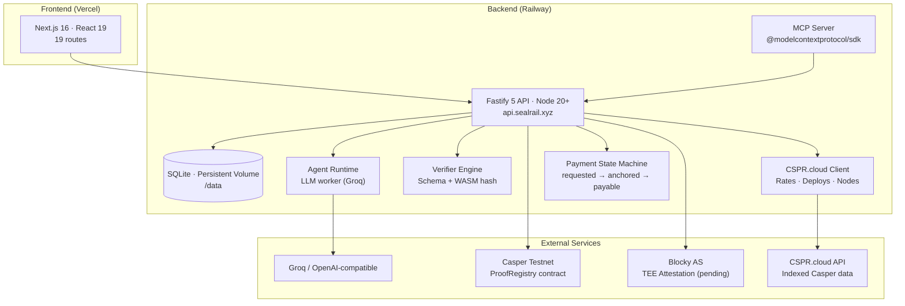
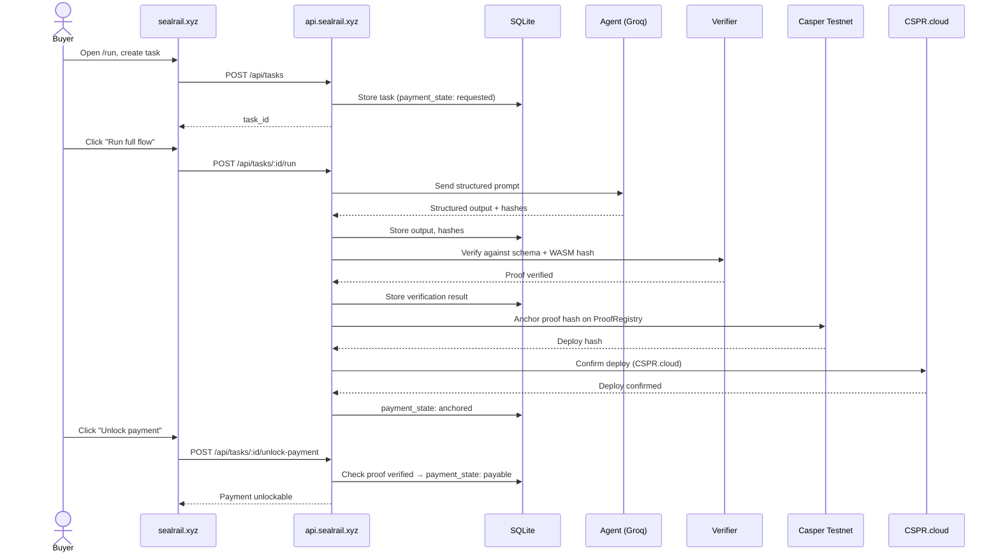
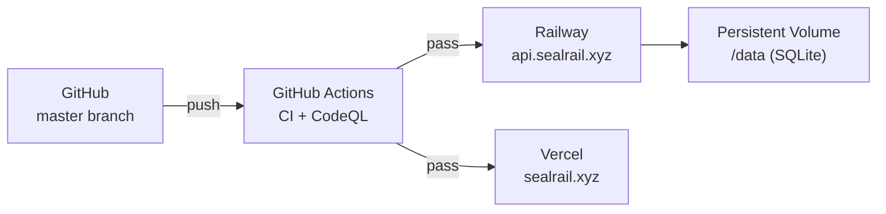

# Architecture: SealRail

Date: 2026-07-03
Phase: DoraHacks Casper Agentic Buildathon submission
Core positioning: No Proof without a Payment.
Deployed on: Railway (backend), Vercel (frontend)

## 1. System architecture



## 2. Full data flow



## 3. Component breakdown

### 3.1 Frontend (sealrail.xyz)

| Page | Route | Purpose |
|---|---|---|
| Homepage | `/` | Product story, hero, primary CTA |
| Run flow | `/run` | One-click proof-gated payment flow |
| Marketplace | `/marketplace` | Invoice Risk Agent + RWA Compliance Agent |
| Marketplace detail | `/marketplace/[id]` | Agent listing detail with pricing |
| Proof explorer | `/proofs` | Browse all anchored proofs |
| Proof detail | `/proofs/[id]` | Full proof trail: hashes, receipt, Casper state |
| Agent registry | `/agents` | Registered agents with code hashes |
| Agent owner | `/owner` | Agent management dashboard |
| Workflows | `/workflows` | Multi-step workflow templates |
| Status | `/status` | Backend, LLM, verifier, Casper, CSPR.cloud status |
| Reviewer quickstart | `/review` | Judge-friendly evaluation path |
| Docs | `/docs` | Architecture, API, trust boundaries |
| Terms | `/terms` | Terms of service |
| Privacy | `/privacy` | Privacy policy |

**Stack**: Next.js 16 (App Router), React 19, Tailwind 4, CSS Modules

### 3.2 Backend API (api.sealrail.xyz)

**Stack**: Fastify 5, TypeScript 5 (strict), better-sqlite3, Node 20+

**Routes**:

| Module | Endpoints |
|---|---|
| Tasks | `POST /api/tasks`, `GET /api/tasks/:id`, `POST /api/tasks/:id/run`, `POST /api/tasks/:id/verify`, `POST /api/tasks/:id/anchor`, `POST /api/tasks/:id/unlock-payment` |
| Proofs | `GET /api/proofs`, `GET /api/proofs/:id` |
| Marketplace | `GET /api/marketplace`, `GET /api/marketplace/:id` |
| Agents | `GET /api/agents`, `POST /api/agents` |
| Status | `GET /api/status`, `GET /api/health` |
| Integrations | `GET /api/integrations/agent-manifest`, `GET /api/integrations/cspr-cloud/status`, `GET /api/integrations/cspr-cloud/deploys/:hash`, `GET /api/integrations/cspr-cloud/rates/cspr/latest` |
| Admin | `GET /api/admin/readiness` |
| Keys | `POST /api/keys`, `GET /api/keys` |

**Services**:

```
backend/src/
  routes/           Fastify route modules
  services/         Domain logic
    agent.ts        Agent dispatch + LLM prompt building
    verification.ts Schema + WASM hash verification engine
    anchoring.ts    Casper client + deploy management
    payments.ts     Payment state machine (requested → anchored → payable)
    reputation.ts   Proof/payment history scoring
    keys.ts         scrypt-hashed API key management
    csprCloud.ts    CSPR.cloud client (deploys, rates, nodes, x402)
  mcp/              MCP stdio server (5 tools)
  scripts/seed.ts   Idempotent first-party record setup
```

**Payment state machine**:

```
requested → proof_pending → proof_verified → anchored → payable → paid
                                                         ↘ failed
```

Core invariants enforced in the state machine:
- No payment unlocks without `proof_verified` state
- Placeholder proofs can never advance state
- Anchor must succeed before `anchored` state
- Payment unlock checks proof ownership + state

### 3.3 CSPR.cloud Integration

Four live endpoints:

```typescript
// 1. Status check — CSPR.cloud API + x402 + node health
GET /api/integrations/cspr-cloud/status
→ { api_reachable, x402_ready, node_healthy, latest_rate, ... }

// 2. Deploy confirmation
GET /api/integrations/cspr-cloud/deploys/:deployHash
→ { deploy_hash, status, block_hash, timestamp, ... }

// 3. CSPR/USD rate
GET /api/integrations/cspr-cloud/rates/cspr/latest
→ { rate: "0.00206217", ... }

// 4. x402 facilitator discovery
GET /api/integrations/cspr-cloud/status
→ { x402_ready: true, networks: ["casper-test"] }
```

Background probe polls CSPR.cloud every 30s, caching results for `/api/status`.

### 3.4 MCP Server

Real `@modelcontextprotocol/sdk` stdio server:

```bash
cd backend && npm run mcp
```

5 tools exposed:

| Tool | Type | Purpose |
|---|---|---|
| `sealrail_status` | Read | Backend, Casper, CSPR.cloud, verifier, trust boundaries |
| `sealrail_agent_manifest` | Read | Machine-readable integration manifest |
| `sealrail_list_proofs` | Read | List proof bundles and payment states |
| `sealrail_get_proof` | Read | Fetch proof bundle by ID |
| `sealrail_create_payment_task` | Write | Create payment-backed task (requires API key) |

Any MCP-compatible agent (Claude, Cursor, Copilot) can discover and call SealRail.

### 3.5 Casper Contract (Odra)

**ProofRegistry** deployed on Casper testnet:

```
Package hash: hash-02f9771e9cd4d91c40705563074bc323d45a341a11987464367ac909cc845846
Deploy tx:    https://testnet.cspr.live/transaction/b2c6a9326545a137c3d7772385e9fe8003129e29f29336d451785e6a7f3a6196
```

Entry points: `register_agent`, `create_payment_intent`, `anchor_proof`, `mark_paid`, `get_agent`, `get_task`

23/23 tests passing (`cargo odra test`).

### 3.6 LLM Agent Runtime

| Provider | Status |
|---|---|
| Groq | Configured, live |
| OpenAI-compatible | `LLM_API_BASE_URL` + `LLM_API_KEY` |
| None | Fails 503 honestly — never fabricates |

Agents receive structured prompts, return hash-bound output with input/output hashes. The verifier checks output against the registered schema + WASM hash before any state can advance.

### 3.7 Blocky TEE Adapter

| Mode | Status |
|---|---|
| `local-server` | Adapter built, CLI integration tested |
| `hosted-tee` | Config-gated, pending Blocky AS access provisioning |
| Unavailable | `GET /api/status` reports honestly — never silently simulates |

## 4. Deployment architecture



- **Railway**: Auto-deploys from `master`, persistent volume for SQLite, health checks against `/api/health`
- **Vercel**: Auto-deploys frontend from `master`, `NEXT_PUBLIC_API_URL=https://api.sealrail.xyz`
- **GitHub Actions**: CI runs 754 backend tests + `tsc --noEmit` + CodeQL on every push

## 5. Environment variables

Backend (`backend/.env`):

| Var | Required | Purpose |
|---|---|---|
| `DATABASE_PATH` | No | SQLite file path (default: `/data/sealrail.db` on Railway) |
| `PORT` | No | Server port (default: 3001) |
| `NODE_ENV` | No | `development` / `production` |
| `LLM_API_BASE_URL` | Yes* | OpenAI-compatible endpoint for agent execution |
| `LLM_API_KEY` | Yes* | API key for LLM provider |
| `LLM_MODEL` | No | Model name (default: `gpt-4o-mini`) |
| `CASPER_MODE` | No | `dry_run` (default), `testnet`, `mainnet` |
| `CASPER_CONTRACT_HASH` | Yes** | Deployed ProofRegistry hash |
| `CSPR_CLOUD_TOKEN` | No | CSPR.cloud API token for Casper data |
| `BLOCKY_MODE` | No | `none` (default), `local-server`, `hosted-tee` |
| `BLOCKY_AS_API_KEY` | No | Blocky AS API key |
| `BLOCKY_AS_HOST` | No | Blocky AS host URL |
| `ALLOW_BOOTSTRAP_KEYS` | No | Permit self-serve API key creation (default: `true`) |
| `FRONTEND_ORIGIN` | No | CORS allowlist |

\* Required for agent execution. Without it, runs fail 503.
\** Required when `CASPER_MODE=testnet` or `mainnet`.

## 6. Trust boundaries

| Layer | Production status | Guard |
|---|---|---|
| CSPR.cloud API | ✅ Live | Token-based auth, public status visible |
| Casper testnet anchoring | ✅ Live | Fails closed if `CASPER_MODE` misconfigured |
| MCP server | ✅ Live | Read tools public, write tool requires API key |
| LLM agent execution | ✅ Live (Groq) | Fails 503 if unconfigured, never fabricates |
| Payment unlock | ✅ Enforced | State machine, placeholder proofs can't advance |
| TEE attestation | ⚠️ Pending | Adapter built, config-gated, never silently simulated |
| Mainnet anchoring | ❌ Not active | Path exists, fails closed |

## 7. Test architecture

| Suite | Count | Framework | Coverage |
|---|---|---|---|
| Backend unit | 754 tests | Vitest | State machine, routes, services, verification, payments, keys, marketplace, CSPR.cloud, MCP |
| Contract | 23/23 | cargo-odra | Agent registry, proof anchoring, payment transitions, error paths |
| TypeScript | tsc --noEmit | TypeScript 5 strict | Full backend + frontend |
| CI | GitHub Actions | CI + CodeQL | Every push to master |
